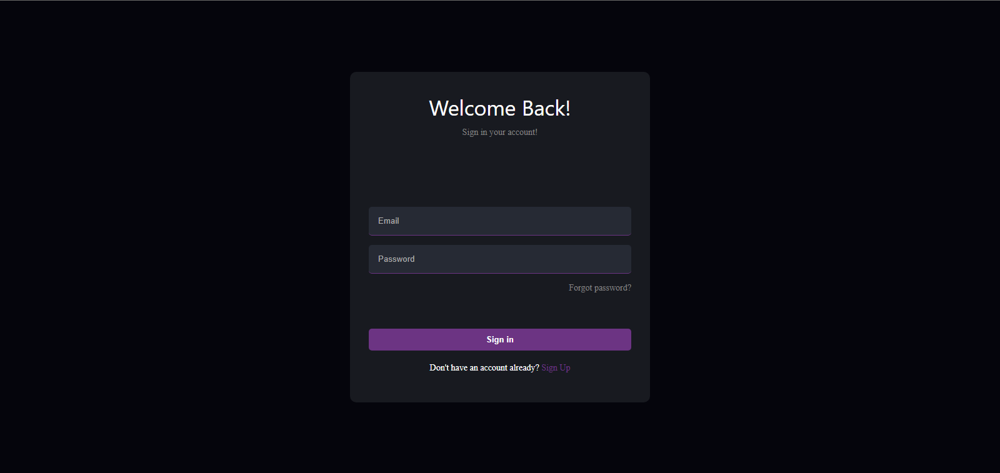
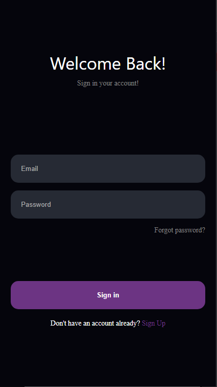
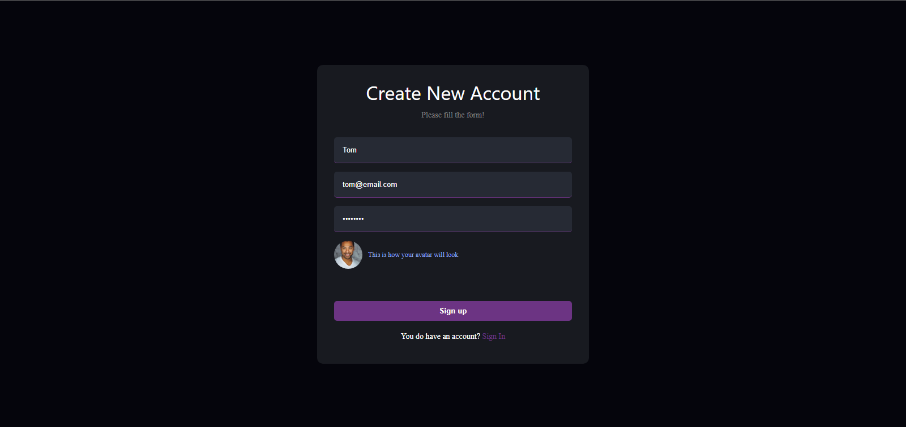
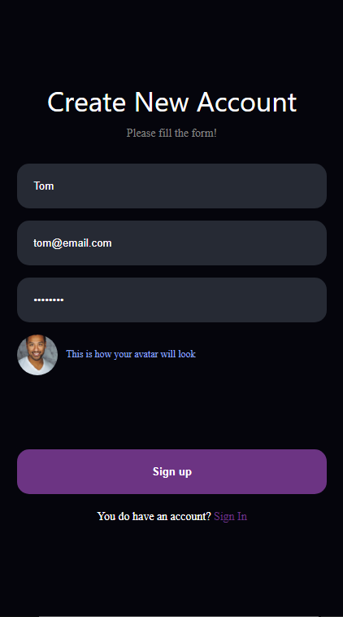
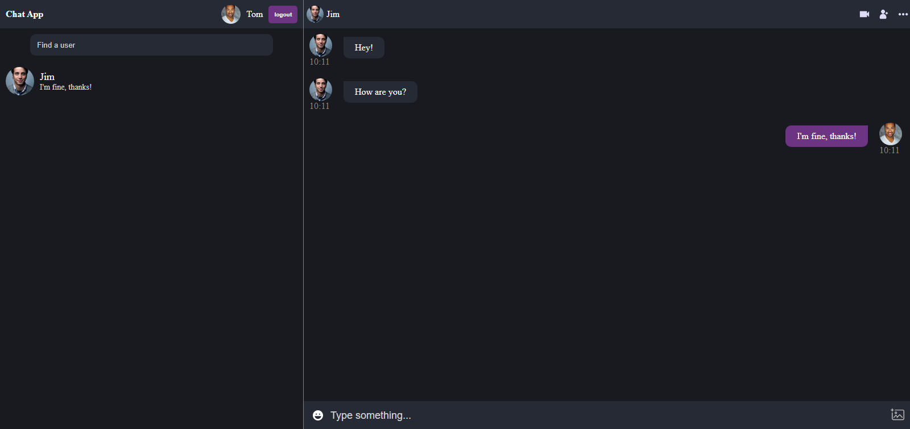
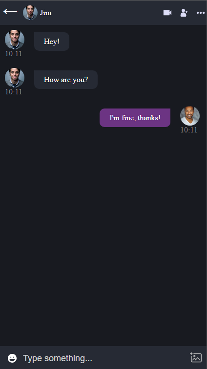

# Chat App

Live preview: https://chat-app-prod-de269.web.app

### Topics

- [Overview](#overview)
- [Stack](#stack)
- [Installation](#setup)
- [Pages](#pages)
  - [Login](#login)
  - [Register](#register)
  - [Chat](#chat)

## Overview

The project is basically a web chat made with React and Firebase as a backend. The application feature a user-friendly interface that allows users to send and receive messages in real-time. Firebase provide the necessary tools for authentication, storage, and real-time data synchronization. The application could also include features such as user profiles, emojis, and image/file sharing. Overall, the combination of React and Firebase allow for a fast and efficient chat experience for the users

## Stack 

These are the stack I used to create the project

<ul>
  <li>React</li>
  <li>Typescript</li>
  <li>Scss</li>
  <li>GitHub Actions for build and deploy to firebase</li>
  <li>Firebase</li>
</ul>

## Setup

Clone this project 
```
  git clone https://github.com/lucasBmm/chat-app.git
```

Enter the project

```
  cd chat-app
```

Install dependencies

```
  npm install
```

Now, you must create a `dev.env` file inside the project folder with the follow structure:\
<small>Learn more about in firebase documentation: https://firebase.google.com/docs/web/learn-more#config-object</small>

```js
  REACT_APP_FIREBASE_APIKEY="yourkey"
  REACT_APP_FIREBASE_AUTH_DOMAIN="yourfirebaseauth"
  REACT_APP_FIREBASE_PROJECT_ID="yourproject"
  REACT_APP_FIREBASE_STORAGE_BUCKET="yourfirebasebucket"
  REACT_APP_FIREBASE_MENSSAGING_SENDER_ID="yourfirebasemessasing"
  REACT_APP_FIREBASE_APP_ID="yourappid"
  REACT_APP_FIREBASE_MEASUREMENT_ID="yourmeasurementid"
```

Finally, start the project in development mode.

```
  npm run start:dev
```

## Pages

These are the pages of the chat project. All was made thinking in responsiveness.

### Login

|    |    |
|-------------------------------------------|------------------------------------------|

### Register

|    |    |
|-------------------------------------------|------------------------------------------|

### Chat
|    |    |
|-------------------------------------------|------------------------------------------|